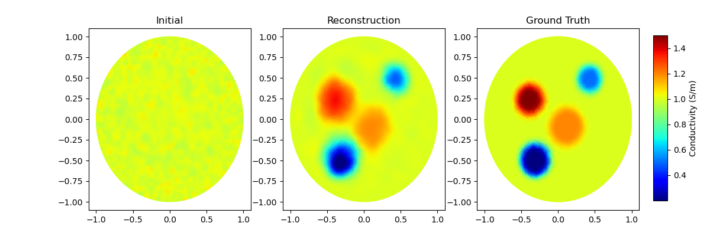
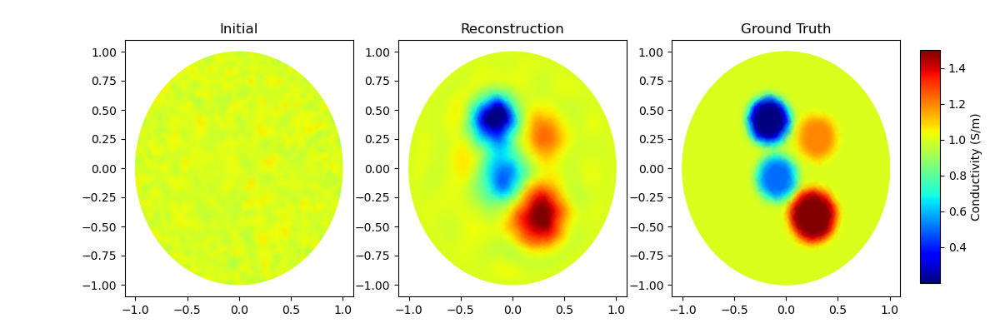
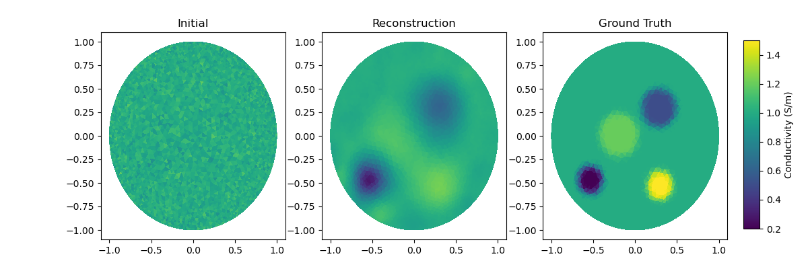

# Code Implementation of DP-SGS for EIT Reconstruction Inverse Problem

This repository contains a concise Python implementation for solving the Electrical Impedance Tomography (EIT) inverse problem, 
focusing on the **Diffusion prior split Gibbs sampler (DP-SGS)** algorithm. For comparative analysis, 
implementations of the **Generative Plug-and-Play with BM3D Denoiser (GPnP-BM3D)** and **Randomize-then-Optimize Metropolis-Hastings (RTO-MH)** algorithms are also provided. 
This code serves as a numerical case study for researchers interested in Bayesian inference and advanced sampling methods for computational inverse problems.

## Environment and Dependencies

The code has been developed and tested with **Python 3.8**. The following Python packages are required to run the algorithms:

### Core Dependencies
- **Local `pyeit` package** (The `pyeit/` folder is included in this repository and must be accessible for import)
- **numpy == 1.23.1**
- **scipy == 1.10.1**
- **matplotlib == 3.5.2** (For result visualization)
- **scikit_image == 0.19.3** (For image processing and metrics)
- **bm3d == 4.0.1** (Core denoising algorithm for GPnP-BM3D)

### Framework & Utilities
- **torch == 1.12.1** (PyTorch for potential neural network components)
- **torchvision == 0.13.1**
- **tensorflow == 2.11.0** (TensorFlow for potential neural network components)
- **datasets == 4.1.0** (For handling data loading)
- **tqdm == 4.65.0** (For displaying progress bars)
- **pandas == 1.4.3** (For data manipulation and analysis)
- **Pillow == 11.3.0** (Python Imaging Library)

### Specialized Libraries
- **mpi4py == 3.1.5** (For parallel computing capabilities)
- **blobfile == 2.1.1** (For cloud storage access, if needed)
- **opencv_python == 4.8.1.78** (OpenCV for computer vision tasks)
- **vispy == 0.5.3** (For high-performance scientific visualization)
- **Shapely == 1.7.1** (For manipulation and analysis of geometric objects)
- **setuptools == 63.4.1** (Packaging and distribution tool)

## Project Structure and File Descriptions

The repository is organized as follows:

### Core Directories
- **`improved_diffusion/`**: Contains the codebase for training the diffusion model. This includes the model architecture, training loops, and related utilities.
- **`pyeit/`**: A local package providing specialized utilities for EIT data computation, including finite element method (FEM) operations, forward solvers, and other domain-specific functions.

### Key Files

#### Main Algorithm Implementations
- **`DP-SGS.py`**: The main script. Provides a simple numerical example implementing the **DP-SGS algorithm** for solving the EIT inverse problem.
- **`BM3D.py`**: Implementation of the **GPnP-BM3D algorithm** for comparative analysis.
- **`RTO_MH.py`**: Implementation of the **RTO-MH (Randomize-then-Optimize Metropolis-Hastings) algorithm** for comparative analysis.

#### Support Modules for DP-SGS
- **`denoiser_diffusion.py`**: Handles the loading and calling of the pre-trained diffusion model (`model045000.pt`) to act as a denoiser within the sampling process.
- **`F1generator.py`**: Implements the Gaussian-Newton optimization part required for the likelihood computation during sampling.
- **`fem2pixel.py`**, **`pixel2fem.py`**: Utility functions for converting data between the finite element mesh space and pixel/image space.

#### Data and Models
- **`model045000.pt`**: A pre-trained diffusion model checkpoint located in the project root, used by `denoiser_diffusion.py`.
- **`cuma.npy`**: Parameter file required by the diffusion model during the sampling process in DP-SGS.

## 📊 Results

The following reconstruction results were obtained by running the respective algorithms on the provided EIT inverse problem example. The figures demonstrate the performance and output of each sampling method.

### 1. DP-SGS Algorithm
Run the main DP-SGS algorithm to generate the reconstruction result:
```bash
python DP-SGS.py
```

*Figure 1: Reconstruction result obtained by the DP-SGS sampler.*

### 2. GPnP-BM3D Algorithm
Run the comparative GPnP-BM3D algorithm:
```bash
python BM3D.py
```

*Figure 2: Reconstruction result obtained by the GPnP-BM3D sampler.*

### 3. RTO-MH Algorithm
Run the comparative RTO-MH algorithm:
```bash
python RTO_MH.py
```

*Figure 3: Reconstruction result obtained by the RTO-MH sampler.*
